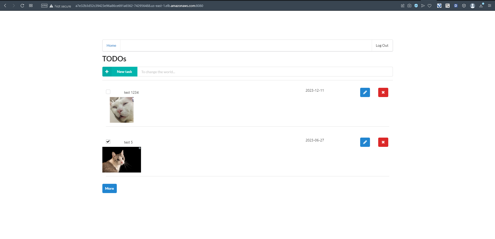
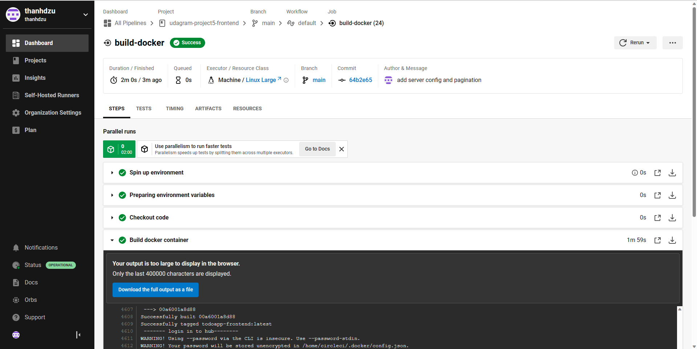
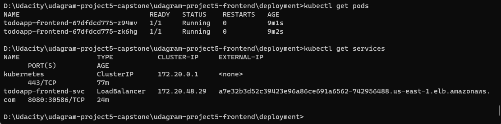
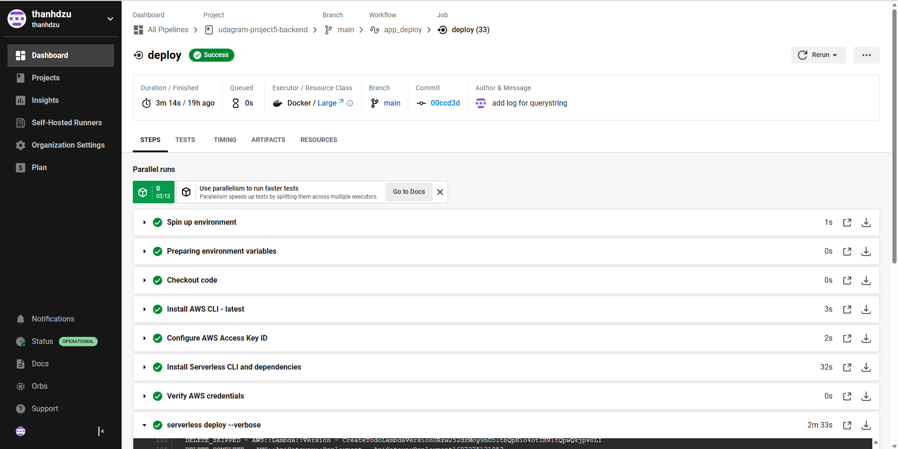
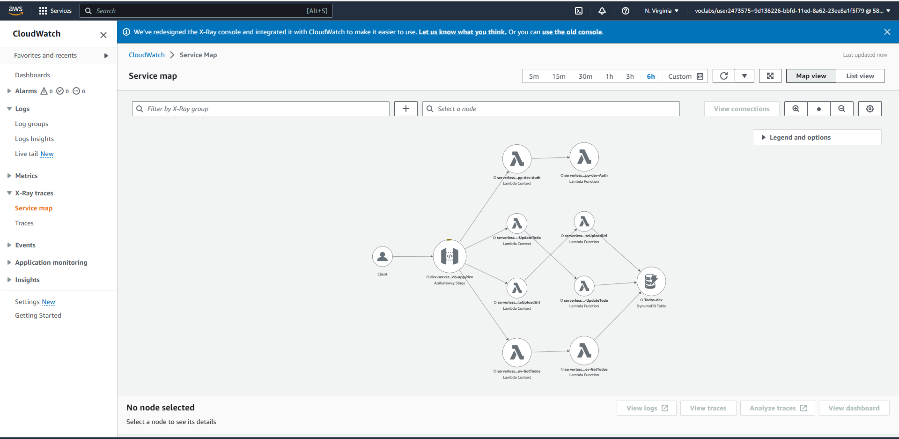
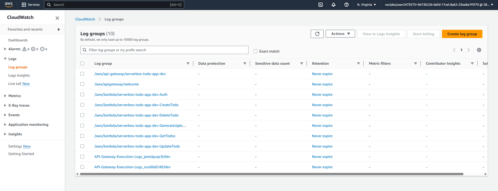
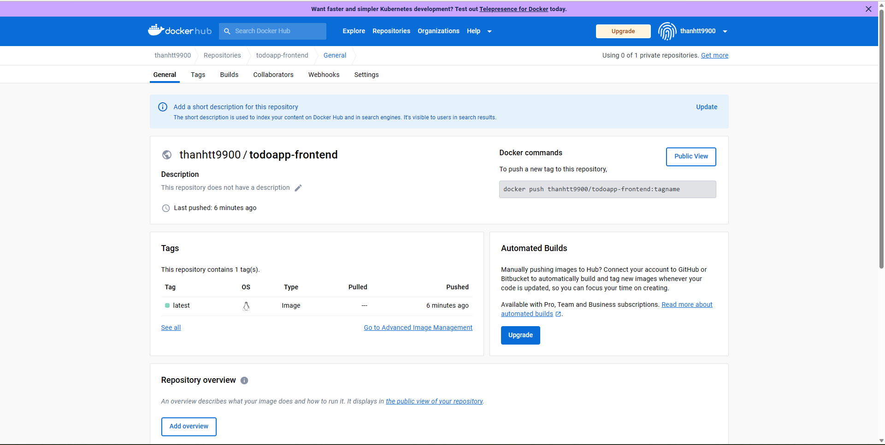

App URL: URL: http://a7e32b3d52c39423e96a86ce691a6562-742956488.us-east-1.elb.amazonaws.com:8080
Git Repo: https://github.com/thanhdzu/udagram-project5-capstone

## Udacity Cloud Developer Capstone Project 

I reused the TODO app from the project 4 and deployed the frontend to AWS using EKS together with circleCI, github and dockerhub. The serverless functions for the backend also remained the same but I completely automated the CI/CD pipeline so that the serverless functions are automatically deployed to AWS when latest source is pushed to github using circleCI.

### TODO application

This is a TODO list application that is used to demonstrate a number of AWS services that were used to build the architecture for this web application.

#### Frontend

The web frontend is developed using [ReactJS](https://reactjs.org/) based on the TODO app from the previous project. It is deployed to AWS using [AWS EKS](https://aws.amazon.com/eks/) service. CI pipeline is done by [circleCI](https://circleci.com). It pulls latest source code form [Github](https://github.com/) and build a docker image before pushing it to [DockerHub](https://hub.docker.com/) to be ready for deployment, 
 
##### circleCI

#### Pods & Services

#### Backend

The web backend is made up of a number of serverless functions using [AWS Lambda](https://aws.amazon.com/lambda/) with Node.js runtime. Along with other resources such as [S3](https://aws.amazon.com/s3/) to store images and a [DynamoDB](https://aws.amazon.com/dynamodb/) table to store TODO items, the serverless function are deployed to AWS using [Serverless framework](https://www.serverless.com/). CI/CD pipeline is completely automated by circleCI.

##### circleCI

# Monitoring
## Distributed tracing

X-Ray tracing has been set up

  

## Logging

The starter code came with a configured [Winston](https://github.com/winstonjs/winston) logger that creates [JSON formatted](https://stackify.com/what-is-structured-logging-and-why-developers-need-it/) log statements. It is used to write log messages like this:

  

##### DockerHub
